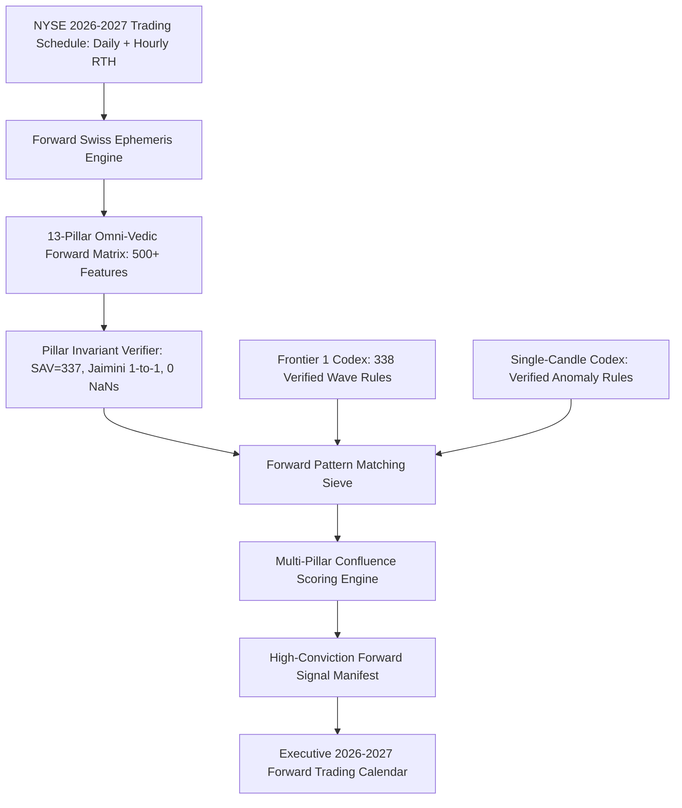

# 📅 FRONTIER 2: FORWARD 2026–2027 PREDICTIVE SIGNAL SCANNER & EPHEMERIS CALENDAR

[]()
[]()
[-purple.svg)]()
[-blue.svg)]()

> **Frontier 2** deploys high-precision Swiss Ephemeris astronomical computation across **2026–2027** for all active NYSE regular trading hours (RTH). It projects all statistically verified Single-Candle Anomaly rules and Multi-Candle Trend Wave rules forward in time to generate an actionable, institutional-grade Predictive Astrological Trading Calendar.

---

## 📑 TABLE OF CONTENTS
1. [Theoretical Architecture](#1-theoretical-architecture)
2. [Forward Ephemeris Generation Engine](#2-forward-ephemeris-generation-engine)
3. [Forward Signal Scanner & Rule Projection](#3-forward-signal-scanner--rule-projection)
4. [2026–2027 Macro Astro-Quant Signals](#4-20262027-macro-astro-quant-signals)
5. [Directory Structure](#5-directory-structure)
6. [How to Run & Reproduce](#6-how-to-run--reproduce)
7. [Automated Verification Gauntlet](#7-automated-verification-gauntlet)

---

## 1. THEORETICAL ARCHITECTURE



---

## 2. FORWARD EPHEMERIS GENERATION ENGINE

* **Coverage**: All active NYSE trading days from **January 1, 2026 to December 31, 2027** (excluding official market holidays).
* **Granularity**:
  * **Daily Open**: 09:30:00 EST for all 504 trading days.
  * **Intraday RTH Bars**: 10:30, 11:30, 12:30, 13:30, 14:30, 15:30 EST (~3,528 total session points).
* **Enriched 13 Pillars**:
  1. Ephemeris & Speeds (Sidereal Lahiri, topocentric Wall St coordinates, stations, retrogrades, OOB).
  2. Zodiac & Nakshatras (27 Nakshatras, 108 Padas, Pushkara Navamshas, Vargottama).
  3. Harmonic Shodashvargas (D1, D9, D10, D60).
  4. Panchanga Limbs (Tithi, Vara, Nithya Yoga, Karana, Paksha).
  5. Bhavas & Angles (Topocentric Lagna, all 66 mutual inter-planetary houses, angular arcs).
  6. Parashari Drishti (Special aspects, combustion, Cazimi).
  7. Ashtakavarga ($\sum \text{SAV} \equiv 337$ invariant, 8 Kakshyas).
  8. Shadbala 6-Fold Potencies (Rupas and minimum requirements).
  9. Jaimini 7 Chara Karakas (Strict 1-to-1 uniqueness).
  10. Sarvatobhadra Chakra (28-Nakshatra grid, 5 Vedha rays, Gochar Murti).
  11. KP Sub-Lord System (249 divisions for Lagna, 10th MC, 11th cusps).
  12. Vimshottari Dasha Engine (120-year rolling cycle for MD, AD, PD).
  13. 4-Entity Multi-Natal Hierarchy (SPY, USA, Fed, NYSE charts, Sade-Sati status, Crisis Count).

---

## 3. FORWARD SIGNAL SCANNER & RULE PROJECTION

The scanner evaluates forward transits against all **338 FDR-significant Trend Wave Rules** ($q < 0.05$, Laplace lift $\ge 1.60\text{x}$, multi-year validation):
* Evaluates active rule conjunctions.
* Computes `Net_Directional_Conviction_Score` ($50.0\% \dots 100.0\%$).
* Classifies forward sessions into:
  - 🐂 **Bullish Thrust Inceptions**
  - 🩸 **Bearish Liquidation Triggers**
  - ⚖️ **Equilibrium / Transition Windows**

---

## 4. 2026–2027 MACRO ASTRO-QUANT SIGNALS

All forward trade dates, conviction ratings, expected percentage moves, and planetary triggers are published in:
👉 [`reports/forward_2026_2027_astro_quant_calendar.md`](reports/forward_2026_2027_astro_quant_calendar.md)

---

## 5. DIRECTORY STRUCTURE

```
frontier_2_forward_scanner/
├── README.md                                       # Master Frontier 2 Technical Documentation
├── data/
│   ├── forward_ephemeris_2026_2027_supreme.parquet # Forward 13-Pillar Ephemeris Matrix
│   └── forward_signals_2026_2027_manifest.parquet  # High-Conviction Signal Manifest
├── reports/
│   └── forward_2026_2027_astro_quant_calendar.md   # Executive Forward Trading Calendar
├── src/
│   ├── __init__.py
│   ├── forward_ephemeris_engine.py                 # Forward Swiss Ephemeris Generator
│   └── forward_signal_scanner.py                   # Forward Rule Matcher & Confluence Scorer
└── tests/
    ├── __init__.py
    └── test_frontier_2_forward_scanner.py          # Automated Pytest Suite
```

---

## 6. HOW TO RUN & REPRODUCE

```bash
# 1. Generate 2026-2027 Forward Ephemeris Matrix
python -m src.calendar.forward_ephemeris_engine

# 2. Run Forward Signal Scanner & Generate Calendar
python -m src.calendar.forward_signal_scanner
```

---

## 7. AUTOMATED VERIFICATION GAUNTLET

```bash
pytest tests/test_frontier_2_forward_scanner.py -v
```
