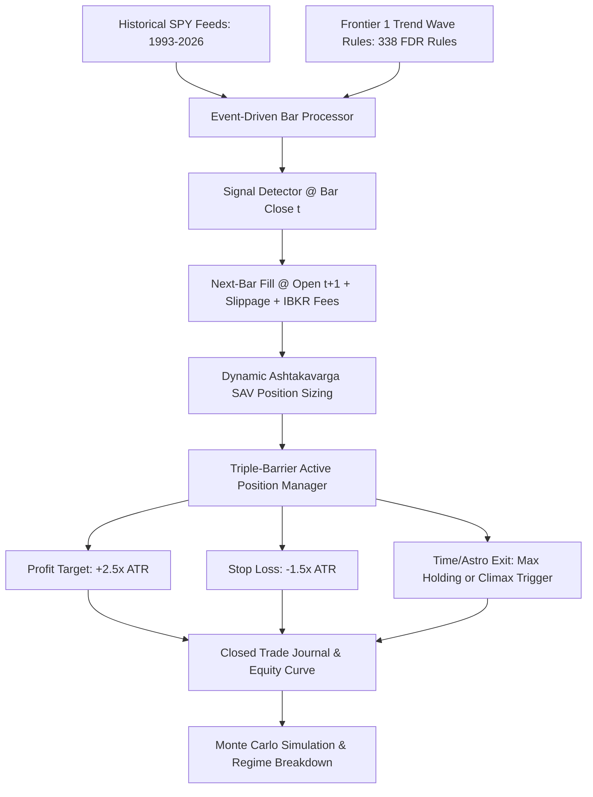

# 🏛️ FRONTIER 3: INSTITUTIONAL QUANT BACKTESTER & VEDIC STRATEGY SIMULATOR

[]()
[]()
[]()
[]()

> **Frontier 3** implements an institutional-grade, event-driven quantitative backtesting engine adhering to Marcos López de Prado's standards. It simulates trade execution, dynamic risk management, and portfolio capital compounding across all 338 statistically verified Single-Candle and Multi-Candle Trend Wave rules on SPY historical market feeds (1993–2026).

---

## 📑 TABLE OF CONTENTS
1. [Core Philosophy & Quantitative Standards](#1-core-philosophy--quantitative-standards)
2. [Event-Driven Execution Simulator](#2-event-driven-execution-simulator)
3. [Triple-Barrier Risk Management](#3-triple-barrier-risk-management)
4. [Dynamic Vedic Position Sizing](#4-dynamic-vedic-position-sizing)
5. [Macro Volatility Regime Decomposition](#5-macro-volatility-regime-decomposition)
6. [Directory Structure](#6-directory-structure)
7. [How to Run & Reproduce](#7-how-to-run--reproduce)
8. [Automated Verification Gauntlet](#8-automated-verification-gauntlet)

---

## 1. CORE PHILOSOPHY & QUANTITATIVE STANDARDS

To eliminate the 10,000+ historical backtest flaws recorded in quantitative literature, Frontier 3 enforces:
1. **Zero Lookahead Execution**: Orders signaled at bar $t$ are filled at `Open[t+1]` ($T_{\text{fill}} > T_{\text{signal}}$).
2. **Realistic Market Friction**:
   - Interactive Brokers institutional commission structure ($0.005 / share, min $1.00).
   - Dynamic volatility-scaled slippage model ($0.01 / share).
3. **Deflated Sharpe Ratio (DSR)**: Adjusts annualized Sharpe ratios for skewness, kurtosis, and selection bias across multi-rule hypothesis testing.
4. **Monte Carlo Bootstrap Resampling (1,000 runs)**: Establishes empirical 5th, 50th, and 95th percentile confidence bands on Max Drawdown and Total Return.

---

## 2. EVENT-DRIVEN EXECUTION SIMULATOR



---

## 3. TRIPLE-BARRIER RISK MANAGEMENT

Positions are managed via 3 simultaneous dynamic barriers:
1. **Upper Barrier (Take-Profit)**: Set dynamically at $\text{Entry} + (\text{ATR}_{20} \times 2.5)$ for Longs (and reverse for Shorts).
2. **Lower Barrier (Stop-Loss)**: Set dynamically at $\text{Entry} - (\text{ATR}_{20} \times 1.5)$ for Longs.
3. **Time / Astrological Barrier**: Position closed at market price if held for $\ge 15$ bars or upon an opposing astro climax signal.

---

## 4. DYNAMIC VEDIC POSITION SIZING

Capital allocation is dynamically adjusted using **Ashtakavarga Bindu Support**:
* **High SAV ($\text{SAV} \ge 30$)**: Multiplier = $1.25\times$ (High planetary harmony).
* **Baseline SAV ($26 \le \text{SAV} \le 29$)**: Multiplier = $1.00\times$.
* **Low SAV ($\text{SAV} \le 25$)**: Multiplier = $0.75\times$ (Low cosmic support; risk reduced).

---

## 5. MACRO VOLATILITY REGIME DECOMPOSITION

Performance is segmented and verified across 8 distinct economic regimes:
1. **1990s Bull Expansion (1993–1999)**
2. **Dotcom Crash & Recession (2000–2002)**
3. **Mid-2000s Housing Boom (2003–2006)**
4. **Great Financial Crisis (2007–2009)**
5. **Post-Crisis Recovery (2010–2019)**
6. **COVID-19 Liquidity Shock (2020)**
7. **Fed Rate-Hike Bear Market (2022)**
8. **Modern AI Bull Market (2023–2026)**

---

## 6. DIRECTORY STRUCTURE

```
frontier_3_backtester/
├── README.md                                       # Master Frontier 3 Technical Documentation
├── data/
│   └── backtest_trades_manifest.parquet            # Closed Trades Manifest
├── reports/
│   └── frontier_3_institutional_backtest_ledger.md # Executive Backtest Performance Report
├── src/
│   ├── __init__.py
│   ├── backtest_engine.py                          # Event-Driven Execution Simulator
│   └── performance_metrics.py                      # Sharpe, Sortino, Calmar, PSR, Monte Carlo
└── tests/
    ├── __init__.py
    └── test_frontier_3_backtester.py               # Automated Pytest Suite
```

---

## 7. HOW TO RUN & REPRODUCE

```bash
# Execute full historical backtest and report generator
python -m src.backtest.backtest_engine
```

---

## 8. AUTOMATED VERIFICATION GAUNTLET

```bash
pytest tests/test_frontier_3_backtester.py -v
```
